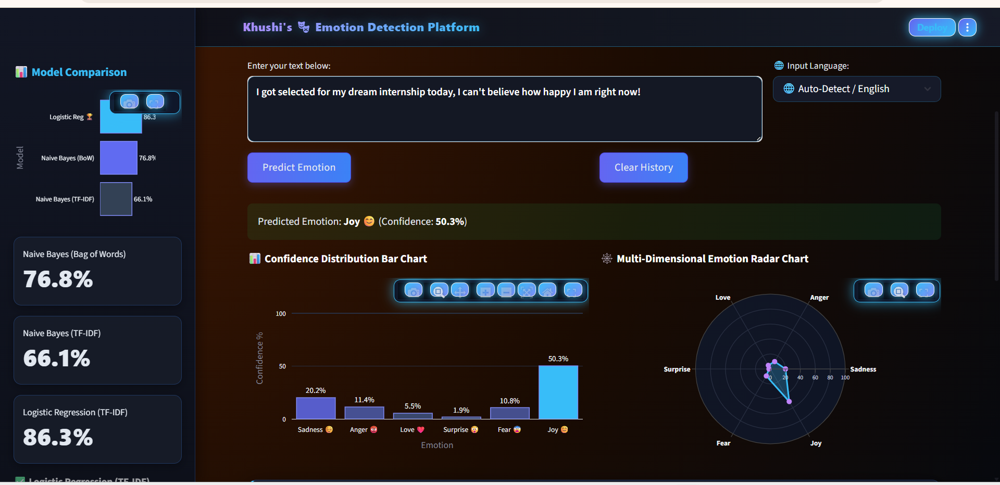

# 🎭 Khushi's Emotion Detection Platform


A multi-class NLP web app that detects emotion in text, voice, or documents using **TF-IDF + Logistic Regression**.

**Emotions:** Sadness 😔 · Anger 😡 · Love ❤️ · Surprise 😲 · Fear 😨 · Joy 😊

🔗 **Live Demo:** _(Streamlit deployment link here once deployed)_

---

## 📑 Table of Contents

- [About the Project](#-about-the-project)
- [Project Workflow](#-project-workflow)
- [Dataset](#-dataset)
- [Live Features](#-live-features)
- [Machine Learning Model](#-machine-learning-model)
- [Application Preview](#️-application-preview)
- [How to Use](#-how-to-use)
- [Tech Stack](#️-tech-stack)
- [Setup](#-setup)
- [Project Structure](#-project-structure)
- [Future Improvements](#-future-improvements)
- [Developer](#-developer)

---

## 📖 About the Project

- Detects the emotion behind a piece of text using classical ML (no deep learning).
- Compares 3 approaches (BoW+NB, TF-IDF+NB, TF-IDF+Logistic Regression) and uses the best one.
- Packaged as a full interactive Streamlit app, not just a notebook.

---

## 🔄 Project Workflow

1. **Input** — text, voice audio, CSV, PDF, or TXT
2. **Text Cleaning** — lowercase → remove punctuation → remove numbers → remove non-ASCII/emoji → remove stopwords
3. **Hinglish Translation** — common Hindi/Hinglish emotion words mapped to English
4. **Feature Extraction** — TF-IDF vectorization
5. **Classification** — Logistic Regression predicts one of 6 emotions
6. **Output** — predicted emotion, confidence score, charts, insights, reports

---

## 📊 Dataset

- **File:** `train.txt`
- **Format:** `text;emotion` (semicolon-separated)
- **Size:** ~16,000 labeled text samples
- **Target values (6 classes):**

  | Label | Emotion |
  |---|---|
  | 0 | Sadness |
  | 1 | Anger |
  | 2 | Love |
  | 3 | Surprise |
  | 4 | Fear |
  | 5 | Joy |

---

## ⚡ Live Features

- Text or voice input (auto speech-to-text)
- Hinglish/Hindi input support
- Confidence bar chart + radar chart (Plotly)
- Emotion-reactive UI theme (background changes per emotion)
- AI rephraser for negative emotions
- AI mood copilot (wellness tips + quotes)
- Filterable prediction history + HTML report export
- Batch prediction from CSV / PDF / TXT
- Word cloud + top-words explainability
- Model comparison chart

---

## 🧠 Machine Learning Model

| Model | Accuracy |
|---|---|
| Naive Bayes (Bag of Words) | 76.81% |
| Naive Bayes (TF-IDF) | 66.09% |
| **Logistic Regression (TF-IDF)** ✅ | **86.28%** |

**Final model:** TF-IDF + Logistic Regression — highest accuracy, interpretable, fast.

---

## 🖼️ Application Preview

(Application Preview: )

---

## 🎮 How to Use

1. Run the app → opens in browser
2. **Predict tab** — type text or upload audio → click Predict
3. **Batch Predict tab** — upload CSV/PDF/TXT → click Run Batch Prediction
4. **Insights tab** — compare models, explore word importance
5. **About tab** — pipeline + model details

---

## 🛠️ Tech Stack

- Streamlit
- scikit-learn
- NLTK
- Plotly
- Matplotlib
- WordCloud
- Seaborn
- SpeechRecognition
- pypdf

---

## 🚀 Setup

```bash
git clone https://github.com/Khushi18Singh/NLP-Emotion_Detection.git
cd <repo-name>
python -m venv venv
venv\Scripts\activate      # Windows
source venv/bin/activate   # Mac/Linux
pip install -r requirements.txt
python -c "import nltk; nltk.download('stopwords')"
streamlit run app.py
```

---

## 📂 Project Structure

```
├── app.py
├── tfidf_vectorizer.pkl
├── logistic_model.pkl
├── model_scores.json
├── requirements.txt
├── README.md
└── notebooks/
    └── Project_NLP.ipynb   # Model training & experimentation
```

> Note: the training dataset (`train.txt`) is not included in this repo.

---

## 🔮 Future Improvements

- Deep learning embeddings (Word2Vec/BERT) for better accuracy
- Multi-label emotion detection
- Proper translation API for Hindi/Hinglish
- Persistent history (database-backed, not session-only)
- Deploy on Streamlit Cloud / Docker
- Model explainability with SHAP/LIME

---

## 👩‍💻 Developer

**Khushi Singh** — NLP & Machine Learning Engineer
